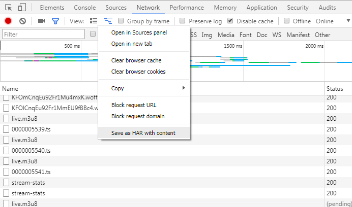

# DLive.tv Har Extractor

takes a .har file, produced by exporting from the google chrome debugger's network tab, and filters out all irrelevant requests. 

### Exporting a .har

 1. Open Chrome and navigate to dlive.tv
 2. Open Chrome dev tools
 3. Select the network tab
 4. Navigate around the site. For veriety I reccomend:
     * Log in
     * Navigate to your channel
     * Navigate to your followed channels
     * Navigate to your subscribed channels
     * Navigate to Browse all channels
     * Navigate to Featured channels
 5. Right click in the network tab and "Save as HAR with content"

### Usage

    Usage: node har-extract [options]
      -k        keep OPTIONS requests.
                default: false
      -i input  the path to the .har you want to parse.
                default: dlive.tv.har
      -o output the path to what output file you want.
                default: dlive.tv.har.extracted
      -u url    the url of the dlive graphql endpoint.
                default: https://graphigo.prd.dlive.tv/
